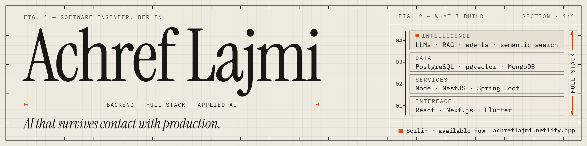

  
  
  
  

---

## 👋 About me

Software engineer in **Berlin**. I work on backend systems and the AI features built on top of them — the data model, the background jobs, and the guardrails that decide what an AI system is actually allowed to do.

My last six months were spent as the **only developer on the AI layer** of a B2B marketplace in Munich: semantic search, recommendations, an agentic assistant, and an autonomous engine that proposes price changes but never applies one without a human decision recorded against it.

I like problems where *"it mostly works"* isn't good enough.

| | |
|:--|:--|
| 📍 **Based in** | Berlin, Germany |
| 💼 **Open to** | Backend · Full-Stack · Applied AI roles across Europe |
| 🎓 **Degree** | Diplôme d'Ingénieur, Computer Science — ESPRIT 2026, *mention Très Bien* (German M.Sc. equivalent, EQF 7) |
| 🗣️ **Languages** | Arabic (native) · French (C1) · English (C1) · German (learning) |
| ⚡ **Currently** | Writing up how an autonomous deal engine stays accountable to a human |

---

## 🛠️ Tech stack

<table>
<tr>
<td><b>⚙️ Backend</b></td>
<td>

</td>
</tr>
<tr>
<td><b>🗄️ Data</b></td>
<td>

</td>
</tr>
<tr>
<td><b>🤖 Applied AI</b></td>
<td>

</td>
</tr>
<tr>
<td><b>🖥️ Frontend</b></td>
<td>

</td>
</tr>
<tr>
<td><b>🚀 Infra</b></td>
<td>

</td>
</tr>
</table>

---

## 📦 Selected work

| Project | What it is | Stack | Links |
|:--|:--|:--|:--|
| 🧭 **SmartPilot** | Autonomous deal engine for a B2B marketplace: scores inventory nightly, proposes price corrections, negotiates through an AI agent, routes deals to matched buyers, and learns from their responses — with no price change without a recorded human decision. | Next.js · PostgreSQL · pgvector · Trigger.dev | 🔒 Company code |
| 🔎 **Hybrid semantic search** | Three-signal retrieval (vector embeddings, full-text, keyword ranking) replacing keyword-only search. Live in production. | pgvector · PostgreSQL | 🔒 Company code |
| 📰 **MASMEDIA AIDITOR** | AI journalism platform. Real-time livestream transcription at 3.2s latency and key-moment detection at 84% precision, validated live on Apple and Google I/O keynotes. Cut event coverage from 4h30 to 1h20. | NestJS · MongoDB · GPT-4 · AssemblyAI | [▶️ Demo](https://www.youtube.com/watch?v=aoA7SMIzSG4) |
| 🧒 **Kiddo AI** | Learning app for six-year-olds with an AI tutor speaking **Tunisian Arabic** and cloned-voice synthesis. I was principal author of the client's second version: MVVM restructure, service layer, voice pipeline. | Flutter · Spring Boot · OpenAI | [💻 Code](https://github.com/achreflajmi/KiddoAI-Front) · [▶️ Demo](https://www.youtube.com/watch?v=NfDOhjPF7VM) |
| 🧠 **MoodyMap** | SwiftUI study planner: hand-built multipart uploads for emotion detection, concurrent loading with task groups, and LLM study plans parsed into checkable tasks. | SwiftUI · async/await | [💻 Code](https://github.com/achreflajmi/FrontIOSMoodyMap) · [▶️ Demo](https://www.youtube.com/watch?v=S_biZwKb0QQ) |
| 🗺️ **SUF'ESS** | Location-based cultural storytelling app with prototype AI guided tours, built end to end in a 24-hour hackathon. | FlutterFlow · RAG | [▶️ Demo](https://www.youtube.com/watch?v=NwJ0WE14vEM) |

---

## 💡 How I work

> **Autonomy and oversight aren't opposites.** A system can detect, propose and distribute entirely on its own, and still never act on anything that matters without a human saying yes.

- 🧱 I start with the data model. Most "AI problems" turn out to be schema problems wearing a costume.
- 🔁 Background jobs, retries and idempotency before features — a pipeline that silently double-sends is worse than no pipeline.
- 🧾 Decisions get stamped on the record they concern, not dumped in a generic audit table.
- 🪫 I'd rather ship something small that holds up than something impressive that needs supervision.
- 📝 I document what's weak in my own systems, because the next person needs to know where to be careful.

---

## 📫 Get in touch

  <a href="https://achreflajmi.netlify.app">🌐 Portfolio</a> &nbsp;·&nbsp;
  <a href="https://linkedin.com/in/achref-lajmi">💼 LinkedIn</a> &nbsp;·&nbsp;
  <a href="mailto:achreflajmi1@gmail.com">✉️ achreflajmi1@gmail.com</a>

Open to backend, full-stack and applied AI roles — Berlin and across Europe 🇪🇺

